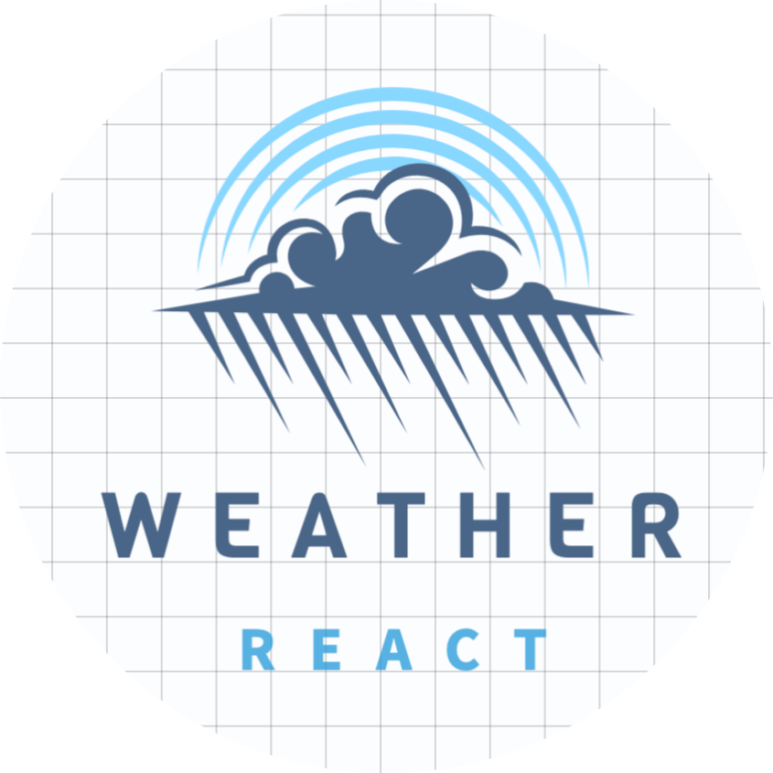
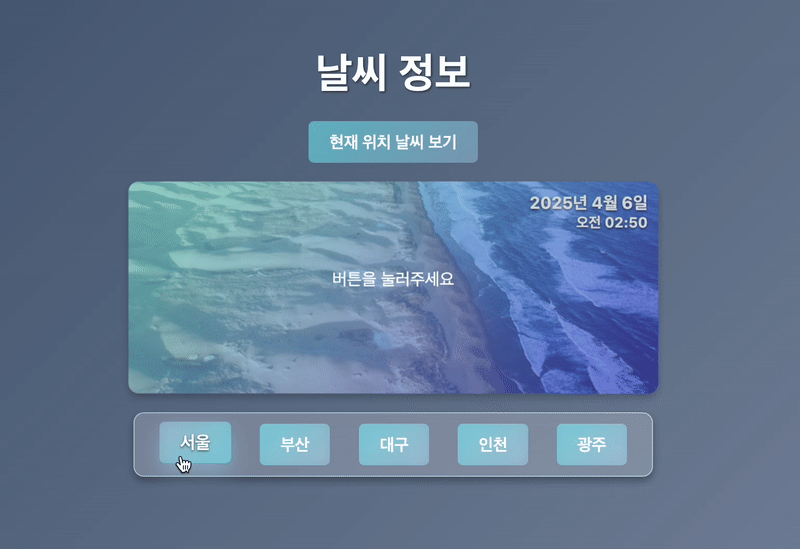

  

<h1 align="center">Weather App</h1>

  
  

    <h4>리액트 스터디 과제 2: 날씨 </h4>
    
<strong>기간: 25.04.05 ~ 06</strong>

  

 

#### Reference

https://codingnoona.thinkific.com/courses/3  
https://codepen.io/Call_in/pen/pMYGbZ  
https://codepen.io/tholman/full/AvWXMr 

